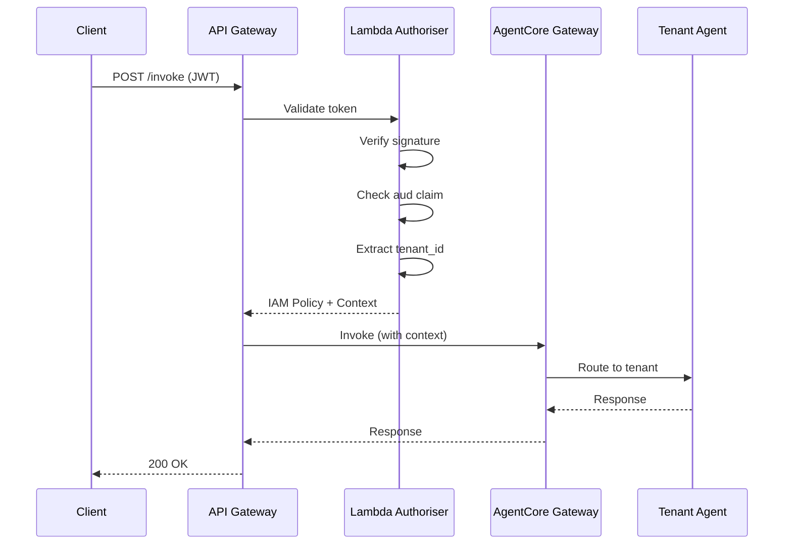
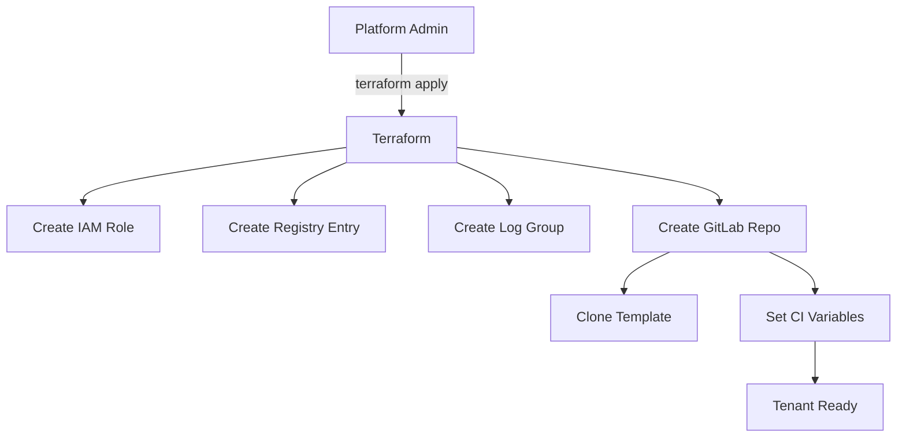

# AgentCore Architecture

This document describes the system architecture, component interactions, security model, and design decisions for the AgentCore multi-tenant platform.

## Contents

1. [System Overview](#system-overview)
2. [Component Architecture](#component-architecture)
3. [Data Flow](#data-flow)
4. [Security Model](#security-model)
5. [Multi-Tenancy Design](#multi-tenancy-design)
6. [Two-Track Release Model](#two-track-release-model)
7. [Technology Decisions](#technology-decisions)

---

## System Overview

AgentCore is a multi-tenant platform enabling organisations to deploy AI agents built with the Strands Agents SDK. The architecture prioritises tenant isolation, operational simplicity, and independent deployment cycles.

```
┌─────────────────────────────────────────────────────────────────────────────┐
│                              External Clients                                │
│                         (Web Apps, Mobile, APIs)                            │
└─────────────────────────────────┬───────────────────────────────────────────┘
                                  │ HTTPS + JWT
                                  ▼
┌─────────────────────────────────────────────────────────────────────────────┐
│                            API Gateway                                       │
│                     (Regional, REST API)                                    │
└─────────────────────────────────┬───────────────────────────────────────────┘
                                  │
                                  ▼
┌─────────────────────────────────────────────────────────────────────────────┐
│                         Lambda Authoriser                                    │
│              ┌─────────────────────────────────────┐                        │
│              │  1. Validate JWT signature          │                        │
│              │  2. Check audience claim            │                        │
│              │  3. Extract tenant_id               │                        │
│              │  4. Generate IAM policy             │                        │
│              └─────────────────────────────────────┘                        │
└─────────────────────────────────┬───────────────────────────────────────────┘
                                  │ IAM Policy + Context
                                  ▼
┌─────────────────────────────────────────────────────────────────────────────┐
│                         AgentCore Gateway                                    │
│                     (Bedrock Agent Runtime)                                 │
│              ┌─────────────────────────────────────┐                        │
│              │  • Session management               │                        │
│              │  • Request routing                  │                        │
│              │  • Rate limiting                    │                        │
│              └─────────────────────────────────────┘                        │
└───────────┬─────────────────────┬─────────────────────┬─────────────────────┘
            │                     │                     │
            ▼                     ▼                     ▼
┌───────────────────┐ ┌───────────────────┐ ┌───────────────────┐
│    Tenant A       │ │    Tenant B       │ │    Tenant C       │
│  ┌─────────────┐  │ │  ┌─────────────┐  │ │  ┌─────────────┐  │
│  │Strands Agent│  │ │  │Strands Agent│  │ │  │Strands Agent│  │
│  │   + Tools   │  │ │  │   + Tools   │  │ │  │   + Tools   │  │
│  └──────┬──────┘  │ │  └──────┬──────┘  │ │  └──────┬──────┘  │
│         │         │ │         │         │ │         │         │
│  ┌──────▼──────┐  │ │  ┌──────▼──────┐  │ │  ┌──────▼──────┐  │
│  │  IAM Role   │  │ │  │  IAM Role   │  │ │  │  IAM Role   │  │
│  │ (Scoped)    │  │ │  │ (Scoped)    │  │ │  │ (Scoped)    │  │
│  └─────────────┘  │ │  └─────────────┘  │ │  └─────────────┘  │
└─────────┬─────────┘ └─────────┬─────────┘ └─────────┬─────────┘
          │                     │                     │
          └─────────────────────┼─────────────────────┘
                                │
                                ▼
┌─────────────────────────────────────────────────────────────────────────────┐
│                         Shared Services                                      │
│  ┌─────────────────────┐  ┌─────────────────────┐  ┌─────────────────────┐  │
│  │   AgentCore Memory  │  │   Amazon Bedrock    │  │     DynamoDB        │  │
│  │   (OpenSearch)      │  │   (Claude 4)        │  │   (Registries)      │  │
│  │                     │  │                     │  │                     │  │
│  │ Namespace isolation │  │ Model invocation    │  │ • Tenant registry   │  │
│  │ per tenant          │  │ via Converse API    │  │ • Agent registry    │  │
│  └─────────────────────┘  └─────────────────────┘  └─────────────────────┘  │
└─────────────────────────────────────────────────────────────────────────────┘
```

---

## Component Architecture

### API Gateway

The entry point for all client requests. Configured as a regional REST API with:

- **Endpoint type**: Regional
- **Authentication**: Lambda authoriser (REQUEST type)
- **Throttling**: Account-level and per-tenant limits
- **Logging**: CloudWatch access logs enabled

### Lambda Authoriser

A Node.js Lambda function that validates incoming JWTs and generates IAM policies.

**Validation Flow:**

1. Extract JWT from `Authorization` header
2. Decode header to get `kid` (key ID)
3. Fetch JWKS from configured endpoint
4. Verify signature using RS256
5. Validate claims:
   - `exp` — Token not expired
   - `aud` — Contains Gateway agent ID
   - `tenant_id` — Present in custom claims
6. Generate IAM policy allowing `bedrock:InvokeAgent`
7. Return policy with `tenant_id` in context

**Why audience validation matters:**

The `aud` claim must contain the Gateway's agent ID. This prevents tokens issued for other environments (e.g., dev tokens used against prod) from being accepted. Each environment has a unique Gateway ID, creating implicit environment binding.

### AgentCore Gateway

A Bedrock Agent configured as the platform's routing layer. The Gateway:

- Maintains session state
- Routes requests to tenant agents
- Enforces rate limits
- Provides conversation context

**Note:** In this architecture, the Gateway is primarily a session manager. Complex routing logic lives in the Lambda authoriser and IAM policies rather than in the agent's instructions.

### Tenant Agents

Each tenant deploys their own agent built with the Strands Agents SDK. Agents are:

- Packaged as Lambda deployment packages
- Stored in S3 (`s3://agentcore-agents-{env}/tenants/{tenant_id}/`)
- Registered in DynamoDB with version metadata
- Invoked via Lambda or Bedrock Agent action groups

**Strands Agent Structure:**

```python
from strands import Agent, tool
from strands.models import BedrockModel

@tool
def tenant_specific_tool(param: str) -> str:
    """Tool docstring drives LLM tool selection."""
    return result

agent = Agent(
    model=BedrockModel(model_id="anthropic.claude-sonnet-4-20250514-v1:0"),
    system_prompt="You are an assistant for {tenant_id}.",
    tools=[tenant_specific_tool],
    session_manager=agentcore_session_manager,  # Memory integration
)
```

### AgentCore Memory

Persistent memory storage using OpenSearch Serverless, accessed via the `bedrock-agentcore` SDK.

**Memory Strategies:**

| Strategy | Purpose | Namespace Pattern |
|----------|---------|-------------------|
| Session Summary | Conversation context | `/summaries/{actorId}/{sessionId}` |
| User Preference | Remembered settings | `/preferences/{actorId}` |
| Semantic Facts | Extracted knowledge | `/facts/{actorId}` |

**Namespace Isolation:**

Each tenant's IAM role restricts memory access to indices matching `tenant-{tenant_id}-*`, preventing cross-tenant data access.

### DynamoDB Registries

Two tables track platform and tenant state:

**Tenant Registry** (`agentcore-tenant-registry-{env}`):

| Attribute | Type | Description |
|-----------|------|-------------|
| `tenant_id` | String (PK) | Unique tenant identifier |
| `name` | String | Display name |
| `tier` | String | Service tier (basic/professional/enterprise) |
| `status` | String | active/suspended/provisioning |
| `execution_role_arn` | String | IAM role for agent execution |
| `created_at` | String | ISO timestamp |

**Agent Registry** (`agentcore-runtime-registry-{env}`):

| Attribute | Type | Description |
|-----------|------|-------------|
| `agent_id` | String (PK) | Format: `{tenant_id}-agent` |
| `tenant_id` | String (GSI) | Parent tenant |
| `version` | String | Deployed commit SHA |
| `package_key` | String | S3 key for deployment package |
| `status` | String | deployed/deploying/failed |
| `deployed_at` | String | ISO timestamp |

---

## Data Flow

### Request Flow

```
1. Client sends POST /invoke with JWT
   │
   ▼
2. API Gateway extracts Authorization header
   │
   ▼
3. Lambda Authoriser validates JWT
   ├─ Invalid → 401 Unauthorized
   │
   ▼ Valid
4. Authoriser returns IAM policy + tenant_id context
   │
   ▼
5. API Gateway invokes AgentCore Gateway
   │
   ▼
6. Gateway retrieves/creates session
   │
   ▼
7. Gateway routes to tenant agent
   │
   ▼
8. Tenant agent assumes its IAM role
   │
   ▼
9. Agent invokes Bedrock (Converse API)
   │
   ▼
10. Agent reads/writes AgentCore Memory
    │
    ▼
11. Response flows back through Gateway
    │
    ▼
12. Client receives response
```

### Deployment Flow (Tenant Agent)

```
1. Developer pushes to main branch
   │
   ▼
2. GitLab CI triggers pipeline
   │
   ▼
3. Validate stage: lint, type-check, security scan
   │
   ▼
4. Test stage: unit tests, integration tests
   │
   ▼
5. Build stage: package agent with dependencies
   │
   ▼
6. Deploy stage (manual trigger):
   ├─ Assume tenant IAM role via OIDC
   ├─ Upload package to S3
   └─ Update DynamoDB registry
   │
   ▼
7. Agent available for invocation
```

---

## Security Model

### Authentication

**JWT Validation:**

- Algorithm: RS256 (asymmetric)
- JWKS endpoint: Configurable (Auth0, Cognito, Okta, etc.)
- Required claims: `exp`, `aud`, `tenant_id`

**Audience Binding:**

Tokens must include the Gateway's agent ID in the `aud` claim. This ties tokens to specific environments:

```
Dev Gateway ID:  arn:aws:bedrock:eu-west-2:123456789012:agent/ABC123DEV
Prod Gateway ID: arn:aws:bedrock:eu-west-2:123456789012:agent/XYZ789PROD

Dev token aud: ["arn:aws:bedrock:eu-west-2:123456789012:agent/ABC123DEV"]
```

A dev token cannot authenticate against prod because the `aud` claim won't match.

### Authorisation

**IAM Role Chain:**

```
Lambda Authoriser
       │
       ▼ Generates policy
API Gateway
       │
       ▼ Invokes with policy
AgentCore Gateway (platform role)
       │
       ▼ Routes request
Tenant Agent
       │
       ▼ Assumes role
Tenant Execution Role (scoped permissions)
```

**Tenant IAM Role Permissions:**

```json
{
  "Version": "2012-10-17",
  "Statement": [
    {
      "Sid": "BedrockInvoke",
      "Effect": "Allow",
      "Action": [
        "bedrock:Converse",
        "bedrock:ConverseStream",
        "bedrock:InvokeModel",
        "bedrock:InvokeModelWithResponseStream"
      ],
      "Resource": ["arn:aws:bedrock:*::foundation-model/anthropic.claude-*"]
    },
    {
      "Sid": "MemoryAccess",
      "Effect": "Allow",
      "Action": ["aoss:APIAccessAll"],
      "Resource": "arn:aws:aoss:*:*:collection/*",
      "Condition": {
        "StringLike": {
          "aoss:index": "tenant-{tenant_id}-*"
        }
      }
    }
  ]
}
```

### Data Isolation

| Layer | Isolation Mechanism |
|-------|---------------------|
| Memory | Namespace prefix (`tenant-{id}-*`) |
| Logs | Separate CloudWatch log groups |
| Packages | S3 prefix (`tenants/{id}/`) |
| IAM | Per-tenant execution role |

---

## Multi-Tenancy Design

### Tenant Tiers

| Tier | Rate Limit | Memory | Models | Support |
|------|------------|--------|--------|---------|
| Basic | 10 req/min | 1GB | Claude Haiku | Community |
| Professional | 100 req/min | 10GB | Claude Sonnet | Email |
| Enterprise | Custom | Custom | All models | Dedicated |

Tier enforcement is handled via:

1. IAM policy conditions (model access)
2. API Gateway usage plans (rate limiting)
3. OpenSearch index quotas (storage)

### Tenant Lifecycle

```
┌──────────────┐     ┌──────────────┐     ┌──────────────┐
│ Provisioning │ ──▶ │    Active    │ ──▶ │  Suspended   │
└──────────────┘     └──────────────┘     └──────────────┘
       │                    │                    │
       │                    │                    │
       ▼                    ▼                    ▼
  Terraform apply     Normal operation     Billing issue
  creates resources   Tenant deploys       API returns 403
                      agents freely
```

**Provisioning creates:**

- IAM execution role
- DynamoDB registry entry
- CloudWatch log group
- GitLab repository (from template)
- CI/CD variables

**Suspension:**

- IAM role trust policy updated to deny `sts:AssumeRole`
- Existing sessions continue until timeout
- Data retained for reactivation

---

## Two-Track Release Model

### Infrastructure Track

**Owner:** Platform team

**Contents:**
- Terraform modules
- IAM policies
- Shared resources (Gateway, Memory collection)
- Authoriser Lambda

**Release process:**

1. Changes reviewed by platform team
2. Terraform plan reviewed for drift
3. Apply during maintenance window
4. Verify tenant agents unaffected

**Cadence:** Weekly or as needed

### Application Track

**Owner:** Individual tenant teams

**Contents:**
- Agent source code (`src/agent.py`)
- Custom tools
- Configuration (`config/agent.yaml`)
- Tests

**Release process:**

1. Developer pushes to main
2. CI validates and tests
3. Manual approval for deployment
4. Package uploaded to S3
5. Registry updated

**Cadence:** As needed (tenant-controlled)

### Benefits of Separation

| Concern | Infrastructure Track | Application Track |
|---------|---------------------|-------------------|
| Change frequency | Low | High |
| Risk profile | Platform-wide | Single tenant |
| Approval required | Platform team | Tenant team |
| Rollback scope | All tenants | One tenant |

---

## Technology Decisions

### Why Strands Agents SDK?

| Consideration | Decision |
|---------------|----------|
| AWS integration | Native Bedrock support, AgentCore Memory integration |
| Simplicity | Model-driven approach, minimal boilerplate |
| Observability | Built-in metrics and tracing |
| Production readiness | Used by Amazon Q Developer, AWS Glue |

### Why OpenSearch Serverless for Memory?

| Consideration | Decision |
|---------------|----------|
| Scalability | Serverless, auto-scaling |
| Vector search | Native support for embeddings |
| AWS integration | IAM-based access control |
| Cost | Pay-per-use, no idle costs |

### Why Lambda Authoriser over Cognito?

| Consideration | Decision |
|---------------|----------|
| Flexibility | Custom claim validation (audience, tenant_id) |
| Multi-IdP support | Works with any OIDC provider |
| Fine-grained policies | Dynamic IAM policy generation |

### Why GitLab CI over AWS CodePipeline?

| Consideration | Decision |
|---------------|----------|
| Tenant familiarity | Most teams already use GitLab |
| OIDC support | Native assume-role without secrets |
| Template repos | Built-in repository templating |
| Self-service | Tenants manage their own pipelines |

---

## Appendix: Mermaid Diagrams

### Request Authentication Flow



### Tenant Provisioning Flow



---

*Document version: 1.0*
*Last updated: January 2026*
